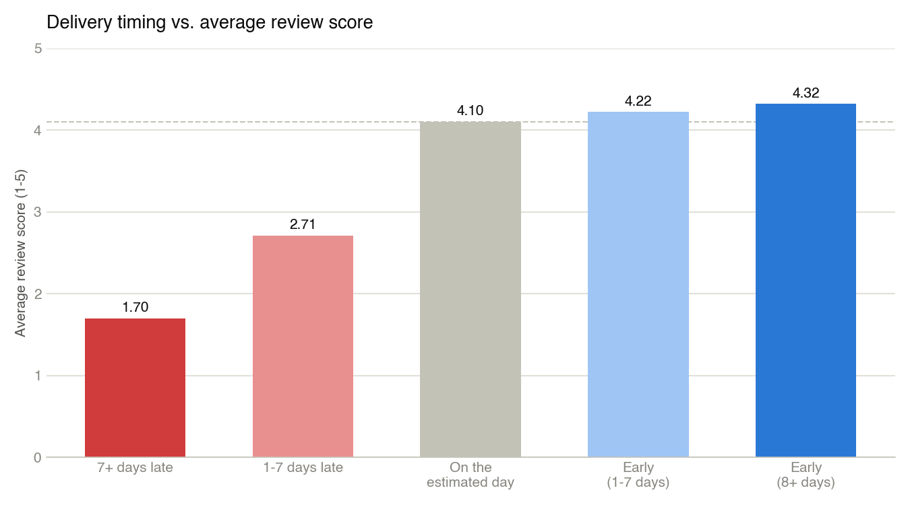

# End-to-End E-Commerce Customer Journey: A PM Case Study

A self-directed product management case study covering the full customer journey in an e-commerce business: discovery, purchase, fulfillment, delivery, and post-purchase experience. Built to practice the exact skill set that shows up in Associate/entry-level technical PM postings: SQL, GA4-style analytics, data visualization, prioritization, PRD writing, QA collaboration, and AI-assisted prototyping.

**[Live interactive dashboard →](https://claude.ai/code/artifact/4b343ae2-f31e-4c63-ae51-77ef521a5498)** — every chart in this repo, one page, real data, hover for exact numbers.

## Why this project

Most PM portfolio pieces are either pure case-study writeups (no data, no proof of technical fluency) or pure SQL/dashboard projects (no product thinking). This one does both, and then goes a step further most portfolio pieces skip: it pressure-tests its own headline finding instead of just reporting it. Real queries against real public datasets, an independent critique of the conclusion, and a real product decision built from what survives that critique — documented the way a PM actually documents it.

## Datasets

- **[GA4 sample e-commerce dataset](https://developers.google.com/analytics/bigquery/web-ecommerce-demo-dataset)** (`bigquery-public-data.ga4_obfuscated_sample_ecommerce`) — real BigQuery event export from the Google Merchandise Store, Nov 2020–Jan 2021. Used for the acquisition and on-site funnel analysis. Free to query in BigQuery's 1TB/month free tier.
- **[Olist Brazilian E-Commerce dataset](https://www.kaggle.com/datasets/olistbr/brazilian-ecommerce)** (Kaggle) — ~100k real orders with purchase timestamps, estimated vs. actual delivery dates, customer review scores, freight costs, and seller/customer geolocation. Used for the fulfillment/delivery and post-purchase analysis.

See `SETUP.md` for exactly how to get both connected (both need a free account — Google Cloud and Kaggle — that I can't create on your behalf).

## Structure

| Folder | What's in it |
|---|---|
| `sql/` | 8 queries: GA4 funnel and channel performance, Olist delivery performance, delay-vs-review-score, distance-vs-delay, repeat-purchase, freight economics, and a review-timing measurement check |
| `analysis/` | `findings.md` (every real number, with charts), `make_charts.py` (regenerates every static chart from the query output), and `limitations-and-alternative-views.md` (an independent critique of the core finding) |
| `dashboard/` | The live interactive dashboard's source — same data, hover tooltips, one page |
| `prd/` | A full PRD for a feature the data justifies, revised after the critique pass changed two pieces of its scope |
| `roadmap/` | RICE-prioritized roadmap, plus a named parallel workstream the data pointed at |
| `prototype/` | Two AI-built clickable prototypes of the feature (order status page, email notification) |
| `qa/` | Test plan, a real runnable trigger-logic simulator (`trigger_simulator.py`), and a defect log with one fixed and one open, correctly-scoped defect |
| `docs/` | Project charter, an Amplitude event-taxonomy spec for the feature, and working docs (stand-in for Confluence) |

## Findings, in one chart

A delivery that lands 7+ days late drops the average review score from ~4.3 to 1.70, and pushes the share of 1-2 star reviews from ~9% to 79%. Being early costs almost nothing. Full findings — including funnel/channel charts, seller-customer distance, repeat-purchase, and freight economics — are in `analysis/findings.md`.

## The finding this project almost missed

97.3% of reviews in the "7+ days late" bucket were submitted *before the package arrived*. Olist's review survey triggers off the estimated delivery date, not actual receipt, so for the bucket the whole PRD is built on, the review is mostly measuring "still overdue," not "arrived late and I'm upset." That doesn't kill the case for the feature — it changes what the success metric needs to compare against. Full derivation in `sql/08_review_timing_vs_delivery.sql`, independently re-verified against the live database before it went anywhere near the PRD.

## Pressure-testing the finding, not just reporting it

A finding that only shows the angle supporting the roadmap decision is less credible than one checked from other directions. Four agents, each given the real data, argued a different lens against the core claim — causal inference, business strategy, customer behavior, and measurement quality (the review-timing finding above came from this pass). A fifth synthesized them into `analysis/limitations-and-alternative-views.md`. Every specific number that critique produced was then independently re-run against the live database by hand before being trusted in the PRD — two of the numbers were off by small amounts and got corrected. The PRD itself was edited afterward: softened from "confirmed the premise cleanly" to what the data can actually support, with two real scope changes, not just an appended disagreement.

## The narrative this builds toward

The data points at a specific, ownable problem: customers aren't proactively told when a delivery is going to miss its promised window, so the first signal they get is silence followed by a late package. `prd/proactive-delivery-notifications-prd.md` scopes a feature to fix that, `roadmap/` sequences it (and names a parallel ops workstream the data surfaced), `prototype/` shows what it looks like, and `qa/` shows how it'd be tested before ship — including a real trigger-logic simulator that found a genuine gap in the v1 rule (`DEF-02`) before any code shipped. That's the full loop: data → critique → decision → spec → build → verify.

## Status

All 8 queries run, findings written up with both static and interactive charts, PRD and roadmap rewritten against the real numbers and the critique pass. The QA defect log has 2 real entries (1 fixed, 1 correctly scoped as a PRD change rather than patched). The Amplitude taxonomy in `docs/` is a specification, not a live instance, since this feature hasn't shipped anywhere real. No fabricated numbers anywhere in this repo — including the ones that turned out to complicate the story.
