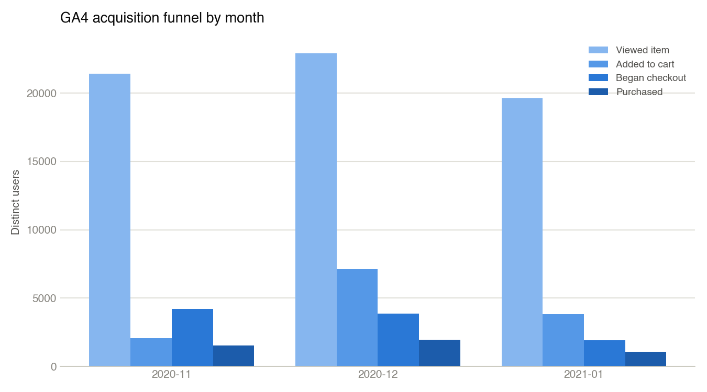
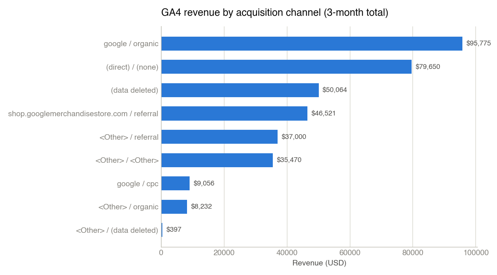
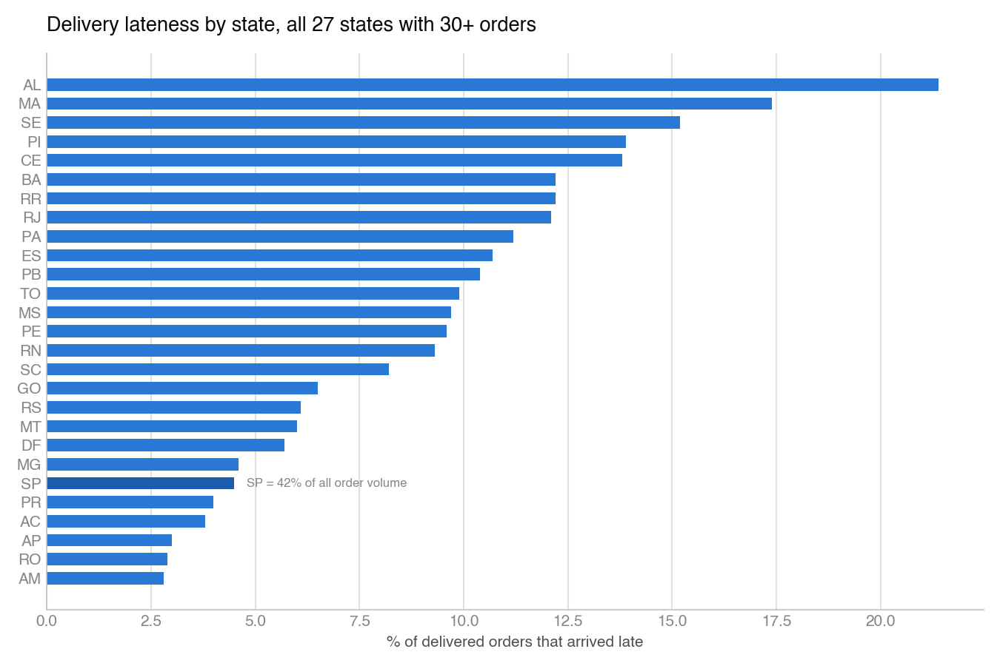

# Findings

## GA4 acquisition funnel (`sql/01_ga4_acquisition_funnel.sql`)

Run against `bigquery-public-data.ga4_obfuscated_sample_ecommerce` (Google Merchandise Store, Nov 2020–Jan 2021) in BigQuery sandbox mode, 179 MB processed.

| Month | Viewed item | Added to cart | Began checkout | Purchased | View→Cart | Cart→Checkout | Checkout→Purchase | Overall conversion |
|---|---|---|---|---|---|---|---|---|
| 2020-11 | 21,440 | 2,060 | 4,219 | 1,532 | 9.6% | 204.8% | 36.3% | 7.1% |
| 2020-12 | 22,906 | 7,113 | 3,859 | 1,975 | 31.1% | 54.3% | 51.2% | 8.6% |
| 2021-01 | 19,629 | 3,832 | 1,924 | 1,069 | 19.5% | 50.2% | 55.6% | 5.4% |

**Read:** overall conversion (view→purchase) ranges 5.4%–8.6% across the three months, with December (holiday shopping) the strongest both in checkout completion (51.2%) and overall conversion (8.6%). View→cart is the weakest and most volatile stage (9.6%–31.1%), suggesting product-page/cart-add friction is the bigger lever here than checkout itself.

**Data quality note, stated plainly rather than smoothed over:** November's cart→checkout rate is 204.8% — more checkouts than cart-adds in the same month. That's a real artifact of this dataset, not a calculation error: Google's own docs for `ga4_obfuscated_sample_ecommerce` warn the obfuscation process limits internal consistency (some fields carry `<Other>` or null placeholders, and event-to-event linkage isn't guaranteed clean). Read November's checkout/purchase figures with that caveat; December and January are more internally consistent.

## GA4 channel performance (`sql/02_ga4_channel_performance.sql`)

Same dataset, all three months combined, 223 MB processed. Metric is `users_started_session` (distinct users triggering `session_start`) rather than a true session count — the dataset's `ga_session_id` event param wasn't reliably populated for `session_start` events, so an exact session-level join returned zero rows. Distinct users is the more robust and still-honest version of "reach."

| Source | Medium | Users (session_start) | Purchasers | Revenue |
|---|---|---|---|---|
| google | organic | 102,530 | 1,229 | $95,775 |
| (direct) | (none) | 75,025 | 1,054 | $79,650 |
| (data deleted) | (data deleted) | 16,969 | 680 | $50,064 |
| shop.googlemerchandisestore.com | referral | 25,350 | 568 | $46,521 |
| \<Other\> | referral | 32,362 | 468 | $37,000 |
| \<Other\> | \<Other\> | 50,776 | 499 | $35,470 |
| google | cpc | 15,449 | 152 | $9,056 |
| \<Other\> | organic | 10,012 | 97 | $8,232 |
| \<Other\> | (data deleted) | 372 | 9 | $397 |

**Read:** Google organic and direct traffic together account for roughly 60% of tracked revenue despite google/cpc (paid search) bringing in a comparable user count (15,449) to some organic-adjacent rows — cpc converts users to purchasers at roughly 1.0%, well below organic's ~1.2% and direct's ~1.4%. On this dataset, paid search isn't outperforming free channels enough to justify weighting a real budget toward it without a deeper look at what's actually being bid on.

## Olist delivery performance by state (`sql/03_olist_delivery_performance.sql`)

Run against the Olist Brazilian E-Commerce dataset (Kaggle, ~100k orders, 2016–2018) loaded into local SQLite. 27 states with 30+ delivered orders, out of 96,353 delivered orders total.

| State | Delivered orders | Avg days late | % late | % on-time or early |
|---|---|---|---|---|
| AL | 397 | -7.95 | 21.4% | 78.6% |
| MA | 717 | -8.77 | 17.4% | 82.6% |
| SE | 335 | -9.17 | 15.2% | 84.8% |
| PI | 476 | -10.47 | 13.9% | 86.1% |
| CE | 1,279 | -9.96 | 13.8% | 86.2% |
| RR | 41 | -16.41 | 12.2% | 87.8% |
| BA | 3,256 | -9.93 | 12.2% | 87.8% |
| RJ | 12,350 | -10.90 | 12.1% | 87.9% |
| PA | 946 | -13.19 | 11.2% | 88.8% |
| ES | 1,995 | -9.62 | 10.7% | 89.3% |
| PB | 517 | -12.37 | 10.4% | 89.6% |
| TO | 274 | -11.26 | 9.9% | 90.1% |
| MS | 701 | -10.17 | 9.7% | 90.3% |
| PE | 1,593 | -12.40 | 9.6% | 90.4% |
| RN | 474 | -12.76 | 9.3% | 90.7% |
| SC | 3,546 | -10.60 | 8.2% | 91.8% |
| GO | 1,957 | -11.27 | 6.5% | 93.5% |
| RS | 5,344 | -12.98 | 6.1% | 93.9% |
| MT | 886 | -13.43 | 6.0% | 94.0% |
| DF | 2,080 | -11.12 | 5.7% | 94.3% |
| MG | 11,354 | -12.30 | 4.6% | 95.4% |
| SP | 40,494 | -10.13 | 4.5% | 95.5% |
| PR | 4,923 | -12.36 | 4.0% | 96.0% |
| AC | 80 | -19.76 | 3.8% | 96.3% |
| AP | 67 | -18.73 | 3.0% | 97.0% |
| RO | 243 | -19.13 | 2.9% | 97.1% |
| AM | 145 | -18.61 | 2.8% | 97.2% |

State names are Brazilian postal abbreviations (SP = São Paulo, RJ = Rio de Janeiro, etc.) — the dataset doesn't spell them out and I haven't relabeled them to avoid mistranslating any. **Read:** São Paulo, the highest-volume state by far (40,494 of 96,353 delivered orders — 42% of all volume) and almost certainly closest to Olist's seller base, has one of the best on-time rates (95.5%). Lower-volume, farther-north/northeast states (Alagoas, Maranhão, Sergipe) see 15–21% of deliveries running late. This is a distance/logistics-coverage problem, not a uniform one — which matters for the PRD: a notification feature should trigger off actual delay signals per-order, not assume a flat national delay rate.

## Olist delay vs. review score (`sql/04_olist_delay_vs_reviews.sql`)

Same dataset, delivered orders joined to their review score, bucketed by how early/late delivery landed against the estimate.

| Delivery timing | Orders | Avg review score | % 1-2 star |
|---|---|---|---|
| 7+ days late | 2,797 | 1.70 | 79.2% |
| 1-7 days late | 3,612 | 2.71 | 49.4% |
| On the estimated day | 2,748 | 4.10 | 11.8% |
| Early (1-7 days) | 20,680 | 4.22 | 10.1% |
| Early (8+ days) | 66,516 | 4.32 | 8.9% |

**Read:** this is the number the whole PRD leans on, and it's a strong, clean signal — not a marginal one. A delivery that's 7+ days late drops the average review from ~4.3 (typical for early/on-time) to 1.7, and the share of 1-2 star reviews jumps from ~9% to 79%. Even a modest 1-7 day delay roughly halves the average score and pushes nearly half of reviews into the 1-2 star range. Being early costs almost nothing — early (8+ days) and early (1-7 days) score almost identically to on-time. The finding isn't "faster is better," it's specifically "late is very costly, and the cost curve is steep, not gradual."

Combined 6,409 orders (2,797 + 3,612) across the full 2016–2018 dataset were late — roughly 6.7% of the 96,353 delivered-and-reviewed orders. That's the reach figure `roadmap/roadmap.md`'s RICE score is built on.
