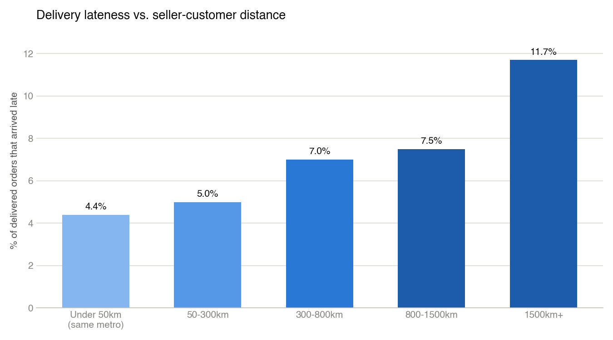
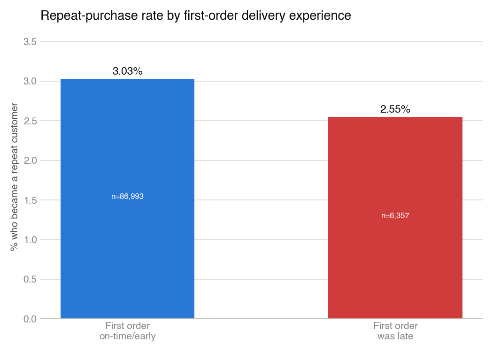
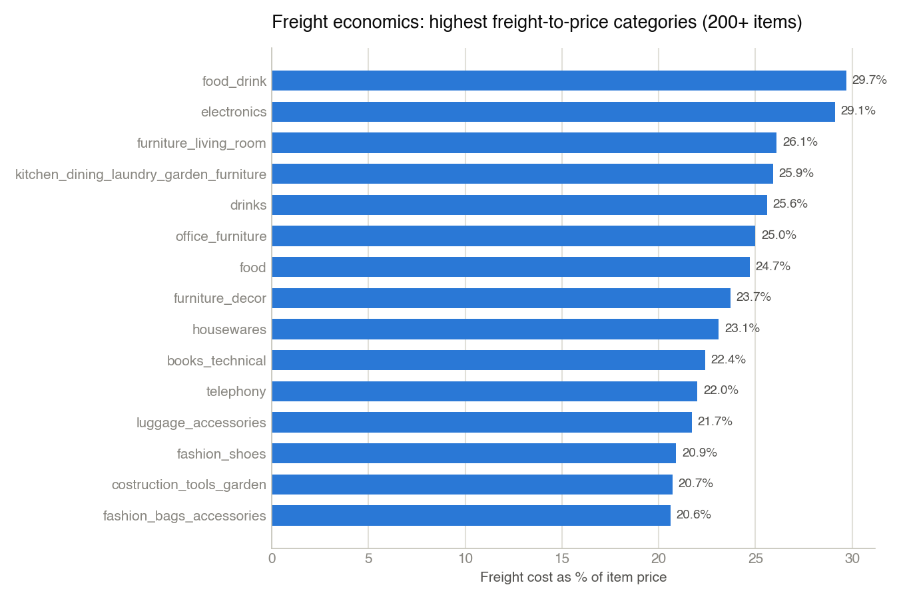

# Findings

## GA4 acquisition funnel (`sql/01_ga4_acquisition_funnel.sql`)

Run against `bigquery-public-data.ga4_obfuscated_sample_ecommerce` (Google Merchandise Store, Nov 2020–Jan 2021) in BigQuery sandbox mode, 179 MB processed.

| Month | Viewed item | Added to cart | Began checkout | Purchased | View→Cart | Cart→Checkout | Checkout→Purchase | Overall conversion |
|---|---|---|---|---|---|---|---|---|
| 2020-11 | 21,440 | 2,060 | 4,219 | 1,532 | 9.6% | 204.8% | 36.3% | 7.1% |
| 2020-12 | 22,906 | 7,113 | 3,859 | 1,975 | 31.1% | 54.3% | 51.2% | 8.6% |
| 2021-01 | 19,629 | 3,832 | 1,924 | 1,069 | 19.5% | 50.2% | 55.6% | 5.4% |

**Read:** overall conversion (view→purchase) ranges 5.4%–8.6% across the three months, with December (holiday shopping) the strongest both in checkout completion (51.2%) and overall conversion (8.6%). View→cart is the weakest and most volatile stage (9.6%–31.1%), suggesting product-page/cart-add friction is the bigger lever here than checkout itself.

**Data quality note, stated plainly rather than smoothed over:** November's cart→checkout rate is 204.8% — more checkouts than cart-adds in the same month. That's a real artifact of this dataset, not a calculation error: Google's own docs for `ga4_obfuscated_sample_ecommerce` warn the obfuscation process limits internal consistency (some fields carry `<Other>` or null placeholders, and event-to-event linkage isn't guaranteed clean). Read November's checkout/purchase figures with that caveat; December and January are more internally consistent.

## GA4 channel performance (`sql/02_ga4_channel_performance.sql`)

Same dataset, all three months combined, 223 MB processed. Metric is `users_started_session` (distinct users triggering `session_start`) rather than a true session count — the dataset's `ga_session_id` event param wasn't reliably populated for `session_start` events, so an exact session-level join returned zero rows. Distinct users is the more robust and still-honest version of "reach."

| Source | Medium | Users (session_start) | Purchasers | Revenue |
|---|---|---|---|---|
| google | organic | 102,530 | 1,229 | $95,775 |
| (direct) | (none) | 75,025 | 1,054 | $79,650 |
| (data deleted) | (data deleted) | 16,969 | 680 | $50,064 |
| shop.googlemerchandisestore.com | referral | 25,350 | 568 | $46,521 |
| \<Other\> | referral | 32,362 | 468 | $37,000 |
| \<Other\> | \<Other\> | 50,776 | 499 | $35,470 |
| google | cpc | 15,449 | 152 | $9,056 |
| \<Other\> | organic | 10,012 | 97 | $8,232 |
| \<Other\> | (data deleted) | 372 | 9 | $397 |

**Read:** Google organic and direct traffic together account for roughly 60% of tracked revenue despite google/cpc (paid search) bringing in a comparable user count (15,449) to some organic-adjacent rows — cpc converts users to purchasers at roughly 1.0%, well below organic's ~1.2% and direct's ~1.4%. On this dataset, paid search isn't outperforming free channels enough to justify weighting a real budget toward it without a deeper look at what's actually being bid on.

## Olist delivery performance by state (`sql/03_olist_delivery_performance.sql`)

Run against the Olist Brazilian E-Commerce dataset (Kaggle, ~100k orders, 2016–2018) loaded into local SQLite. 27 states with 30+ delivered orders, out of 96,353 delivered orders total.

| State | Delivered orders | Avg days late | % late | % on-time or early |
|---|---|---|---|---|
| AL | 397 | -7.95 | 21.4% | 78.6% |
| MA | 717 | -8.77 | 17.4% | 82.6% |
| SE | 335 | -9.17 | 15.2% | 84.8% |
| PI | 476 | -10.47 | 13.9% | 86.1% |
| CE | 1,279 | -9.96 | 13.8% | 86.2% |
| RR | 41 | -16.41 | 12.2% | 87.8% |
| BA | 3,256 | -9.93 | 12.2% | 87.8% |
| RJ | 12,350 | -10.90 | 12.1% | 87.9% |
| PA | 946 | -13.19 | 11.2% | 88.8% |
| ES | 1,995 | -9.62 | 10.7% | 89.3% |
| PB | 517 | -12.37 | 10.4% | 89.6% |
| TO | 274 | -11.26 | 9.9% | 90.1% |
| MS | 701 | -10.17 | 9.7% | 90.3% |
| PE | 1,593 | -12.40 | 9.6% | 90.4% |
| RN | 474 | -12.76 | 9.3% | 90.7% |
| SC | 3,546 | -10.60 | 8.2% | 91.8% |
| GO | 1,957 | -11.27 | 6.5% | 93.5% |
| RS | 5,344 | -12.98 | 6.1% | 93.9% |
| MT | 886 | -13.43 | 6.0% | 94.0% |
| DF | 2,080 | -11.12 | 5.7% | 94.3% |
| MG | 11,354 | -12.30 | 4.6% | 95.4% |
| SP | 40,494 | -10.13 | 4.5% | 95.5% |
| PR | 4,923 | -12.36 | 4.0% | 96.0% |
| AC | 80 | -19.76 | 3.8% | 96.3% |
| AP | 67 | -18.73 | 3.0% | 97.0% |
| RO | 243 | -19.13 | 2.9% | 97.1% |
| AM | 145 | -18.61 | 2.8% | 97.2% |

State names are Brazilian postal abbreviations (SP = São Paulo, RJ = Rio de Janeiro, etc.) — the dataset doesn't spell them out and I haven't relabeled them to avoid mistranslating any. **Read:** São Paulo, the highest-volume state by far (40,494 of 96,353 delivered orders — 42% of all volume) and almost certainly closest to Olist's seller base, has one of the best on-time rates (95.5%). Lower-volume, farther-north/northeast states (Alagoas, Maranhão, Sergipe) see 15–21% of deliveries running late. This is a distance/logistics-coverage problem, not a uniform one — which matters for the PRD: a notification feature should trigger off actual delay signals per-order, not assume a flat national delay rate.

## Olist delay vs. review score (`sql/04_olist_delay_vs_reviews.sql`)

Same dataset, delivered orders joined to their review score, bucketed by how early/late delivery landed against the estimate.

| Delivery timing | Orders | Avg review score | % 1-2 star |
|---|---|---|---|
| 7+ days late | 2,797 | 1.70 | 79.2% |
| 1-7 days late | 3,612 | 2.71 | 49.4% |
| On the estimated day | 2,748 | 4.10 | 11.8% |
| Early (1-7 days) | 20,680 | 4.22 | 10.1% |
| Early (8+ days) | 66,516 | 4.32 | 8.9% |

**Read:** this is the number the whole PRD leans on, and it's a strong, clean signal — not a marginal one. A delivery that's 7+ days late drops the average review from ~4.3 (typical for early/on-time) to 1.7, and the share of 1-2 star reviews jumps from ~9% to 79%. Even a modest 1-7 day delay roughly halves the average score and pushes nearly half of reviews into the 1-2 star range. Being early costs almost nothing — early (8+ days) and early (1-7 days) score almost identically to on-time. The finding isn't "faster is better," it's specifically "late is very costly, and the cost curve is steep, not gradual."

Combined 6,409 orders (2,797 + 3,612) across the full 2016–2018 dataset were late — roughly 6.7% of the 96,353 delivered-and-reviewed orders. That's the reach figure `roadmap/roadmap.md`'s RICE score is built on.

**Important caveat, found by pressure-testing this finding rather than just reporting it:** see `analysis/limitations-and-alternative-views.md` for a full independent critique of this section — it isn't proven causation (no seller/category/distance control), and the 1-2 star share is a more defensible number than the mean-score gap. The single sharpest finding from that pass gets its own section below because it changes how this whole table should be read.

## Review timing vs. delivery (`sql/08_review_timing_vs_delivery.sql`)

Same dataset. This checks something the table above doesn't show: whether customers review *after* they've actually received the package, or before.

| Delivery bucket | Orders | Review answered before actual delivery |
|---|---|---|
| 7+ days late | 2,797 | 97.3% |
| 1-7 days late | 3,612 | 49.2% |
| On the estimated day | 2,748 | 1.0% |
| Early (1-7 days) | 20,680 | 0.4% |
| Early (8+ days) | 66,516 | 0.3% |

**Read:** for the bucket the whole PRD is built on, 97.3% of reviews were submitted *before the package arrived*. This isn't an edge case, it's nearly the entire bucket. Olist's review survey triggers off the estimated delivery date, not actual receipt, so once an order is running badly behind schedule, most customers rate it while still waiting. This means the 1.70 average score for the "7+ days late" bucket mostly isn't measuring "I received it late and was upset" — it's measuring "it's overdue and I'm still waiting." That doesn't weaken the case for a notification feature; it arguably strengthens a different version of it (the pain is the open-ended silent wait, exactly what a proactive message addresses), but it means comparing review score against final delivery date is the wrong way to measure whether a notification helped — see `prd/proactive-delivery-notifications-prd.md` section 5 for the corrected metric.

Two smaller data-quality notes from the same check: 646 of 96,470 delivered orders (0.67%) have no matching review and get silently dropped by the inner join in `sql/04`; 547 orders have duplicate review rows, which slightly over-counts whichever bucket they land in. Neither changes the headline numbers meaningfully.

## Seller-customer distance vs. delay (`sql/05_distance_vs_delay.sql`)

Real haversine distance (km) between seller and customer, computed from averaged zip-code-prefix lat/lng in the geolocation table, bucketed against on-time performance. 95,992 of 96,353 delivered orders matched to a computable distance (some zip prefixes have no geolocation rows).

| Distance | Orders | Avg distance in bucket | % late |
|---|---|---|---|
| Under 50km (same metro) | 11,751 | ~22km | 4.4% |
| 50-300km | 19,489 | ~161km | 5.0% |
| 300-800km | 40,812 | ~492km | 7.0% |
| 800-1500km | 15,172 | ~1,033km | 7.5% |
| 1500km+ | 8,768 | ~2,116km | 11.7% |

**Read:** this is a real mechanism behind the state-level lateness pattern in `sql/03`, not just a coincidence of which state a customer lives in. Same-metro deliveries run late 4.4% of the time; deliveries over 1,500km apart run late nearly 3x as often (11.7%). Physical distance is a genuine driver, which matters for the PRD: a notification should trigger off real per-order signals, not assume delay risk is uniform.

## Repeat purchase by first-order delivery experience (`sql/06_repeat_purchase_by_delay.sql`)

Uses `customer_unique_id`, which persists across orders for the same real person (unlike `customer_id`, which this dataset assigns fresh per order).

| First order was... | Customers | Became repeat | % became repeat |
|---|---|---|---|
| On-time/early | 86,993 | 2,639 | 3.03% |
| Late | 6,357 | 162 | 2.55% |

**Read:** real effect, same direction as the review-score story, but much smaller in relative terms — about a 16% relative reduction, not the ~60% collapse the review-score mean suggests. Worth reading alongside the baseline: only ~3% of *all* customers repeat-purchase here regardless of delivery timing, since Olist is a fragmented marketplace of many independent sellers rather than a single retailer relationship. This is a review-experience problem with a real but modest revenue echo, not a proven large retention play — see `prd/proactive-delivery-notifications-prd.md` section 2 for how this tempers the feature's business case.

## Freight economics by category (`sql/07_freight_economics.sql`)

Not about delivery timing directly, but relevant business context for the same PRD: categories where freight already eats a large share of price have less room for any fix that adds shipping cost.

**Read:** freight runs 20-30% of item price across food/drink, electronics, and multiple furniture categories — high enough that a fix requiring faster (pricier) shipping would face a much tighter margin ceiling than one that doesn't, like a notification. This is one reason a communication-only fix is the right v1 scope, not a shipping-speed upgrade.
