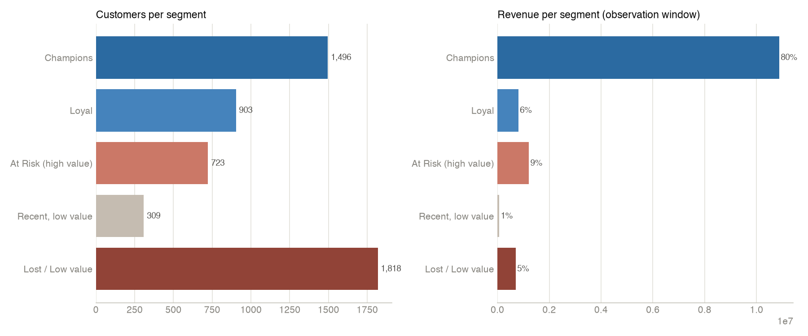
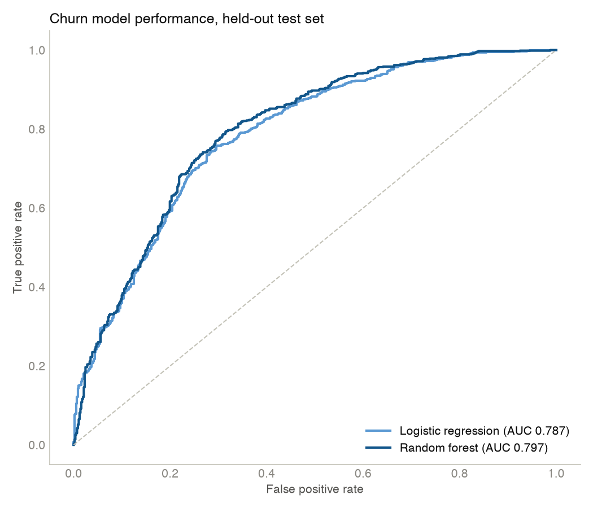
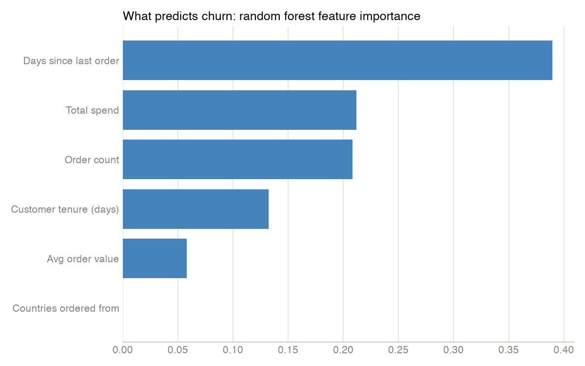
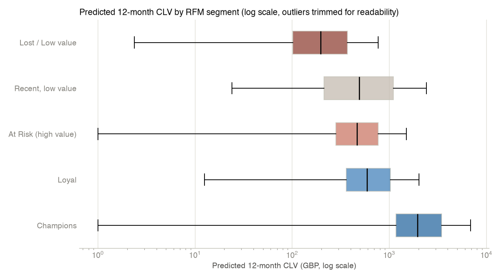
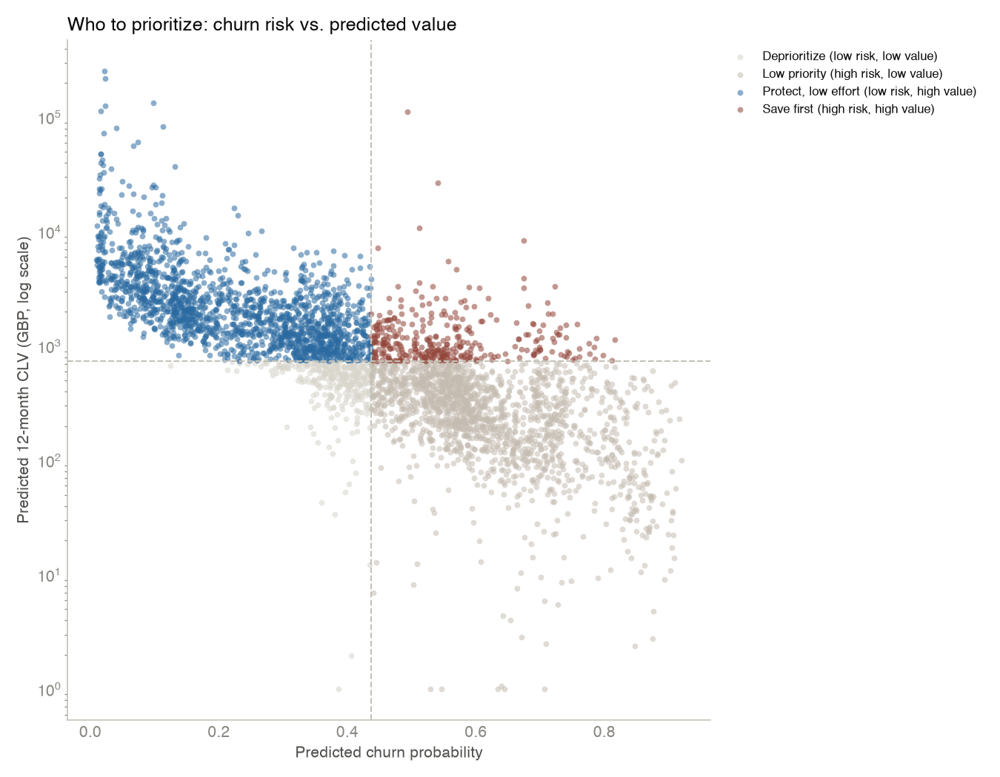

# Findings

Full derivation in `clv_churn_analysis.ipynb` — this is the executed notebook, not a separate write-up of numbers computed elsewhere. Every number below is copied from that notebook's actual output.

## Data

[UCI Online Retail II](https://archive.ics.uci.edu/dataset/502/online+retail+ii): 1,067,371 raw line items, a UK-based online gift wholesaler, December 2009–December 2011. After dropping rows with no Customer ID (22.8%), matching and removing 6,476 cancelled orders back to the specific original order each one reverses (not just the cancellation record itself — see the notebook's Section 1 for why that distinction mattered), and dropping non-product stock codes: **796,622 clean rows, 5,840 unique customers, GBP 16,836,361 in revenue.**

83.6% of revenue is UK. Order values and line-item quantities run wide enough (90th-percentile order ~£834, some line items in the thousands of units) that this reads as a wholesale-skewed customer base, not a pure consumer storefront — flagged again below.

## RFM segmentation

| Segment | Customers | Revenue share | 90-day churn rate |
|---|---|---|---|
| Champions | 1,496 | ~80% | 23% |
| Loyal | 903 | 6% | 50% |
| At Risk (high value) | 723 | 9% | 64% |
| Recent, low value | 309 | 1% | 65% |
| Lost / Low value | 1,818 | 5% | 82% |

**Read:** under 30% of customers drive roughly 80% of revenue. Churn rate climbs almost monotonically as RFM segment quality drops, which is the segmentation validating itself — Champions churn at less than a third the rate of Lost/Low value.

## Churn model

Churn defined as: purchased before a cutoff set 90 days before the last date in the data, then made no purchase in those 90 days. 90 days was chosen from the data's own inter-purchase gap distribution (median 25 days, 75th percentile 63 days for repeat customers), not a default borrowed from elsewhere.

| Model | AUC | Precision | Recall |
|---|---|---|---|
| Logistic regression | 0.787 | 0.748 | 0.779 |
| Random forest | 0.797 | 0.772 | 0.757 |

**Read:** the two models agree closely enough (AUC within a point) that logistic regression — fully interpretable, coefficients you can say out loud — is the one to actually hand to a stakeholder, not the random forest's marginally better AUC. Both models agree on what drives churn: recency dominates, order frequency and total spend are protective, and which country a customer orders from carries no signal at all (zero random-forest importance).

## Customer lifetime value

BG/NBD + Gamma-Gamma (the standard probabilistic-CLV pairing), fit on the full two-year history, 4,172 customers with a repeat purchase (Gamma-Gamma needs at least one repeat transaction to estimate spend variability; 1,668 single-purchase customers are excluded from this step for that reason).

| Segment | Mean 12-month CLV | Median |
|---|---|---|
| Champions | £3,913 | £1,954 |
| Loyal | £1,002 | £590 |
| Recent, low value | £822 | £489 |
| At Risk (high value) | £646 | £467 |
| Lost / Low value | £294 | £196 |

**The mismatch worth reading closely:** "At Risk (high value)" scored high on *historical* RFM (used to buy often, used to spend a lot) but its *forward* CLV is modest — close to Loyal, well below Champions. That's the CLV model doing its job, not an error: BG/NBD conditions its forecast on how long it's been since the last order, and this segment's defining trait is a long gap. RFM answers "who was valuable"; CLV answers "who is still likely to be valuable." They're not supposed to always agree.

## Who to prioritize

Combining churn risk (scored on the full eligible customer base) and predicted CLV, split at each measure's median:

| Quadrant | Customers | Total 12-month CLV |
|---|---|---|
| Protect, low effort (low risk, high value) | 1,650 | £6,280,333 |
| **Save first (high risk, high value)** | **326** | **£565,689** |
| Low priority (high risk, low value) | 1,650 | £492,205 |
| Deprioritize (low risk, low value) | 326 | £167,589 |

**The headline finding:** 326 customers — the "save first" pool — represent 7.5% of all projected 12-month value across the customer base and are the specific, boundable group a retention effort should target first. This is a directional finding, not a costed ROI: there's no cost-per-outreach data in this dataset, so it stops at "here's the value at stake," not "here's the expected return on a specific campaign."

## The bug this analysis caught in itself

Before the cancellation-matching fix in the notebook's Section 1, one customer's 80,995-unit order — placed and cancelled 12 minutes later — was still counted as revenue, because dropping only invoices that start with `C` (the standard approach for this dataset) removes the cancellation record but not the original order it reverses. That single order inflated one segment's mean predicted CLV roughly 4x in an earlier pass. Matching each cancellation back to the specific original order it reverses, and dropping both, fixed it. Full detail in the notebook.

## Limitations

- **22.8% of raw rows have no Customer ID** and were dropped; whatever caused that (till system, guest checkout) isn't visible in the data, so there's no way to check whether the remaining customers are representative.
- **Wholesale and consumer buying behavior are mixed together** with no flag distinguishing them. A reseller's 90-day restock gap looks identical to a churn signal in this model, but the right action for each is different. Not separated here.
- **Churn is a heuristic label** (90 days without an order), not an observed event like a cancelled contract.
- **Cancellation matching only catches exact-quantity matches**; a partial cancellation (order 10, cancel 4) won't match and the original stays in the data at full quantity.
- **UK-centric**: 83.6% of revenue is UK, so the model is mostly learning UK patterns.
